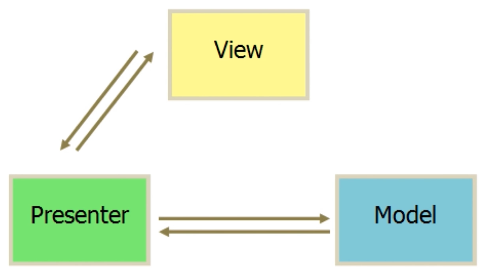
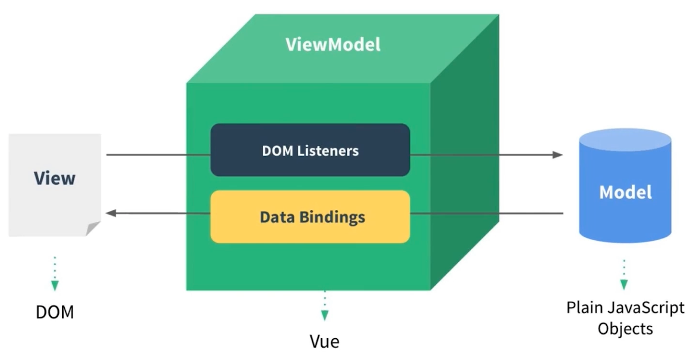

# 开发去哪儿网App

## 第一章
### 1-1 课程简介
基础内容->基础语法->mvvm模式->组件化
生命周期->动画特效
实战项目->环境搭建->使用git->数据模拟->本地开发
联调->真机调试->上线

#### 技术点
`Axios` `Vuex` `Stylus` `插件` `Vue Router` `异步组件` `递归组件` `公用组件`

#### 课程安排
- 第1章 课程介绍
- 第2章 Vue初探
- 第3-5章 基础知识精讲
- 第6-9章 Vue项目实战
- 第10张 项目测试上线流程及后续学习指南

#### 基础必备
`.js` `ES6` `webpack` `npm`

## 第二章
### 2-1 课程学习方法
看官网文档，官网已经镜像到该项目。

### 2-2 Hello World
- [1.demo](./../demo/1/2-2/index.html)

### 2-3 TodoList (`v-model` `v-for` `v-on`)
> [http://www.todolist.cn/](http://www.todolist.cn/)

- [2.demo](./../demo/1/2-3/index.html)

### 2-4 MVVM模式
#### MVP 设计模式 
**一切皆dom**
如图:

- [3.demo](../demo/1/2-4/jquery.html)
#### MVVM 设计模式 
**一切皆数据**
如图：

### 2-5 前端组件化
### 2-6 使用组件化思想修改TodoList
- [4.demo](../demo/1/2-6/index.html)

### 2-7 简单的组件间传值
- [5.demo](../demo/1/2-7/index.html)
