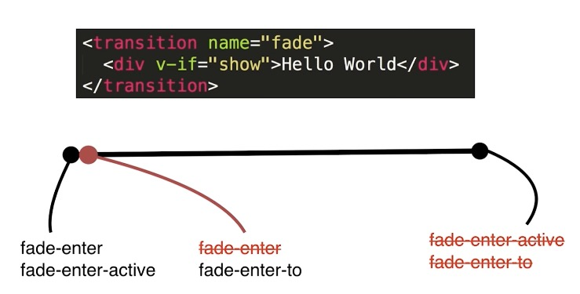
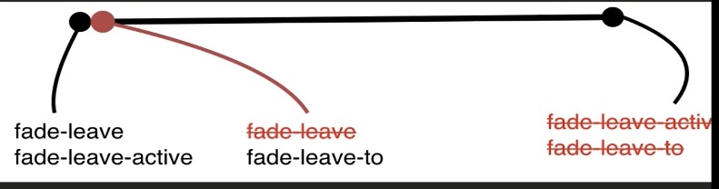
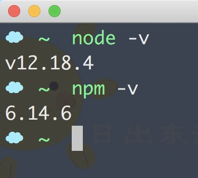
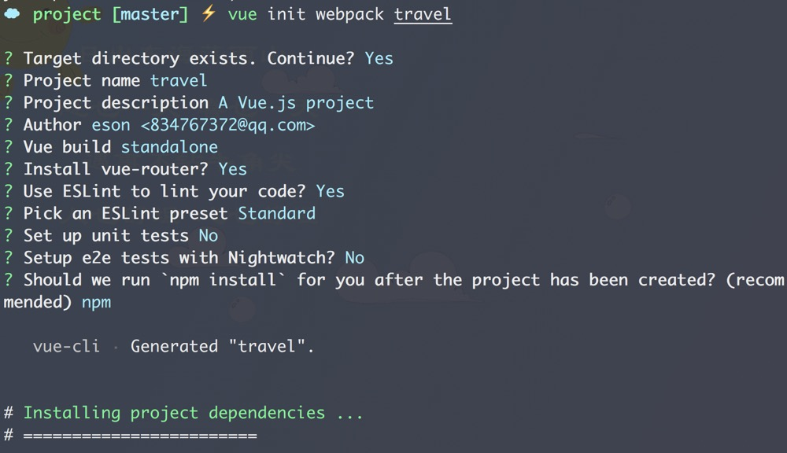
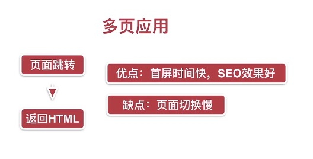
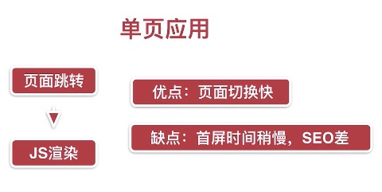

# 开发去哪儿网App

## 第一章
### 1-1 课程简介
基础内容->基础语法->mvvm模式->组件化
生命周期->动画特效
实战项目->环境搭建->使用git->数据模拟->本地开发
联调->真机调试->上线

#### 技术点
`Axios` `Vuex` `Stylus` `插件` `Vue Router` `异步组件` `递归组件` `公用组件`

#### 课程安排
- 第1章 课程介绍
- 第2章 Vue初探
- 第3-5章 基础知识精讲
- 第6-9章 Vue项目实战
- 第10张 项目测试上线流程及后续学习指南

#### 基础必备
`.js` `ES6` `webpack` `npm`

## 第二章
### 2-1 课程学习方法
看官网文档，官网已经镜像到该项目。

### 2-2 Hello World
- [1.demo](./../demo/1/2-2/index.html)

### 2-3 TodoList (`v-model` `v-for` `v-on`)
> [http://www.todolist.cn/](http://www.todolist.cn/)

- [2.demo](./../demo/1/2-3/index.html)

### 2-4 MVVM模式
#### MVP 设计模式 
**一切皆dom**
如图:

- [3.demo](../demo/1/2-4/jquery.html)
#### MVVM 设计模式 
**一切皆数据**
如图：


### 2-5 前端组件化
### 2-6 使用组件化思想修改TodoList
- [4.demo](../demo/1/2-6/index.html)

### 2-7 简单的组件间传值
- [5.demo](../demo/1/2-7/index.html)

## 第三章
### 3-1 Vue实例
- [6.demo](../demo/1/3-1/index.html)

### 3-2 Vue实例生命周期
- [7.demo](../demo/1/3-2/index.html)
如图:


### 3-3 Vue的模板语法
- [8.demo](../demo/1/3-3/index.html)

### 3-4 计算属性，方法和侦听器
- [9.demo](../demo/1/3-4/index.html)

### 3-5 计算属性的`setter`和`getter`
- [10.demo](../demo/1/3-5/index.html)

### 3-6 Vue中的样式绑定
- [11.demo](../demo/1/3-6/index.html)

### 3-7 Vue中的条件渲染
- [12.demo](../demo/1/3-7/index.html)

### 3-8 Vue中的列表渲染
- [13.demo](../demo/1/3-8/index.html)

### 3-9 Vue中的`set`方法
>在13demo中接着控制台输入

方法的方式：
```javascript
Vue.set(vm.userInfo, 'address', '成都');
Vue.set(vm.arr, 1, 10);
```

实例的方式：
```javascript
vm.$set(vm.userInfo, 'address', '成都');
Vue.set(vm.arr, 2, 11);
```

## 第四章
### 4-1 使用组件的细节点
- [14.demo](../demo/1/4-1/index.html)
    - `<tbody></tbody>`标签里面只能写`<tr></tr>`标签，可以用`is`属性来表示组件名称。
    - 子组件定义`data`必须是一个函数，`vue`定义`data`是一个对象。
    - `ref`引用的方法使用。

### 4-2 父子组件的数据传递
- [15.demo](../demo/1/4-2/index.html)
    - `单向数据流`的隐形规定，子组件不能修改父组件传过来的值。子组件可以定义`data`存储父组件的值，才可以修改。

### 4-3 组件参数校验与非props特性
- [16.demo](../demo/1/4-3/index.html)

### 4-4 给组件绑定原生事件
- [17.demo](../demo/1/4-4/index.html)

### 4-5 非父子组件间的传值
- [18.demo](../demo/1/4-5/index.html)
    - 发布订阅模式
    - vuex

### 4-6 在Vue中使用插槽
- [19.demo](../demo/1/4-6/index.html)

### 4-7 Vue中的作用域插槽
- [20.demo](../demo/1/4-7/index.html)

### 4-8 动态组件与v-once指令
- [21.demo](../demo/1/4-8/index.html)

## 第五章
### 5-1 Vue中CSS动画原理
- [22.demo](../demo/1/5-1/index.html)



### 5-2 在Vue中使用Animate.css库
> [https://animate.style/](https://animate.style/)

- [23.demo](../demo/1/5-2/index.html)

### 5-3 在Vue中同时使用过渡和动画
- [24.demo](../demo/1/5-3/index.html)

### 5-4 Vue中的Js动画与Velocity.js的结合
> [http://velocityjs.org/](http://velocityjs.org/)

- [25.demo](../demo/1/5-4/index.html)

### 5-5 Vue中多个元素或组件的过渡
- [26.demo](../demo/1/5-5/index.html)

### 5-6 Vue中的列表过渡
- [27.demo](../demo/1/5-6/index.html)

### 5-7 Vue中的动画分装
- [28.demo](../demo/1/5-7/index.html)

### 5-8 章节小节
- [动态过渡](http://vue/v2/guide/transitions.html#%E5%8A%A8%E6%80%81%E8%BF%87%E6%B8%A1)
- [状态过渡](http://vue/v2/guide/transitioning-state.html)

## 第六章
### 6-1 Vue项目预热环境配置
- [node安装](https://nodejs.org/zh-cn/download/)

- vue安装 [vue-cli安装](https://cli.vuejs.org/zh/guide/installation.html)


### 6-2 项目代码结构介绍
```
./
├── .git
├── ...
│
└── travel
    ├── .babelrc
    ├── .editorconfig
    ├── .eslintignore
    ├── .eslintrc.js
    ├── .gitignore
    ├── .postcssrc.js
    ├── README.md
    ├── build
    │  ├── build.js
    │  ├── check-versions.js
    │  ├── logo.png
    │  ├── utils.js
    │  ├── vue-loader.conf.js
    │  ├── webpack.base.conf.js
    │  ├── webpack.dev.conf.js
    │  └── webpack.prod.conf.js
    ├── config
    │  ├── dev.env.js
    │  ├── index.js
    │  └── prod.env.js
    ├── index.html
    ├── node_modules
    ├── ...
    │
    ├── package-lock.json
    ├── package.json
    ├── src
    │  ├── App.vue
    │  ├── assets
    │  │  └── logo.png
    │  ├── components
    │  │  └── HelloWorld.vue
    │  ├── main.js
    │  └── router
    │      └── index.js
    └── static
        └── .gitkeep
```

### 6-3 单文件组件与Vue中的路由
project/travel 2be05488800ba0cc4970ec7f392615d110dfbb99

### 6-4 多页应用VS单页应用



### 6-5 项目代码初始化
`maximum-scale=1.0, minimum-scale=1.0, user-scalable=no`
手指放大缩小无效页面比例始终是1:1

`npm install fastclick --save`
点击事件延迟不统一的兼容

## 第七章
### 7-1 Vue项目首页 - header区域开发
project/travel 6c71f5166a4fc9c3d9ff90444698fa1a331bdd3f
- 安装依赖包
`npm install stylus --save` 
`npm install stylus-loader --save`
- 项目实践中的安装
`npm i stylus@0.54.5`
`npm i stylus-loader@3.0.1`
- [stylus](https://stylus.bootcss.com/) 

### 7-2 Vue项目首页 - iconfont 的使用和代码优化
> https://www.iconfont.cn/

project/travel ac09eba44baeec065f72ca8b1f520e10511f66c0

- iconfont 的使用
- stylus 样式引入
- 引入链接的别名设置 build/webpack.base.conf.js

### 7-3 Vue项目首页 - 首页轮播图
tip: 新建分支进行轮播图功能开发

project/travel bb4579a1084331bfe87dfe0eae2931b616971e5a

- 安装轮播插件 [Vue-Awesome-Swiper](https://github.com/surmon-china/vue-awesome-swiper) 建议使用稳定的老版本 [v2.6.7](https://github.com/surmon-china/vue-awesome-swiper/tree/v2.6.7)
`npm install vue-awesome-swiper@2.6.7 --save` 

### 7-4 Vue项目首页 - 图标区域页面布局

project/travel 91eead30cc1992568f3196c68cfaea561720b9fe

### 7-5 Vue项目首页 - 图标区域页面逻辑实现

project/travel 503328f1ba95e217b9c389c249a7c2de08d33035

### 7-6 Vue项目首页 - 热销推荐组件开发

project/travel a3c12a9b21d11629e46f97575fc95274748185d8

### 7-7 Vue项目首页 - 周末游组件开发

project/travel 362a2262943aaeb459bc814bde93ec1c389ccc88

### 7-8 Vue项目首页 - 使用axios发送ajax请求

project/travel 2f04283aa3cb9482d4a7bab14766a5d60798ad23

- 安装`axios`
`npm install axios --save` 

### 7-9 Vue项目首页 - 首页父子组件间传值

project/travel 1244a22d7759d0126718468bb47fcda420c37010
